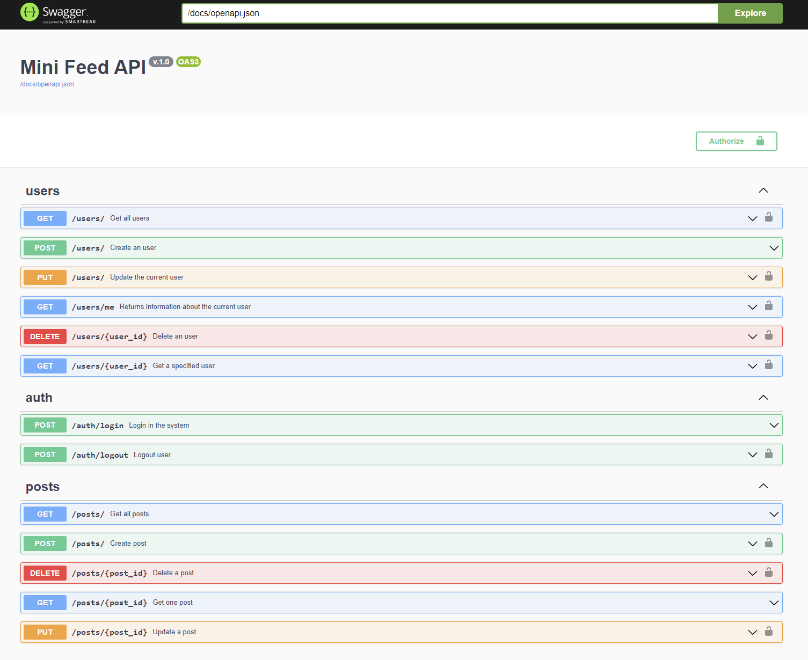

# Desenvolvimento Web: Backend

Esse projeto é parte do curso [Desenvolvimento Web: Backend](https://neps.academy/br/course/desenvolvimento-web:-backend) no [Neps Academy](https://neps.academy/br).

Para aprender todos os detalhes sobre a implementação desse projeto nós recomendamos participar do curso.

### MiniFeed API

Esse projeto implementa a API de um feed de notícias. A API inclue:

- Integração com o Banco de Dados
- Usuários
- Postagens
- Cargos (Roles)
- Documentação Swagger gerada de forma automática
- Autenticação (login e logout)



Uma demonstração da API está disponível [online](https://minifeed.neps.academy/docs/swagger/).

### Setup

Para realizar o setup da API no seu computador você precisará ter o [Python e o PIP](https://www.python.org/downloads/) instalados.

É recomendado criar um _Virtual Enviroment_ antes de isntalar as dependências.

Para instalar as dependências do projeto execute execute:

```bash
pip install -r requirements.txt
```

Para criar o banco de dados execute os seguintes comandos (no Windows):

```bash
set FLASK_APP="main.py"
flask db init
flask db migrate
flask db upgrade
```

Para popular o banco de dados com dados de teste execute o seguinte comando:

```bash
python populate_database.py
```

Para rodar o projeto execute o seguinte comando:

```bash
python main.py
```

Em seguida você já pode acessar a API através do endereço http://localhost:5000. Para acessar a documentação e interagir com a API visite http://localhost:5000/docs/swagger.

### Mudanças

Caso alguma mudança tenha sido feita no projeto mas não tenha sido atualizada no curso ela será listada aqui.
